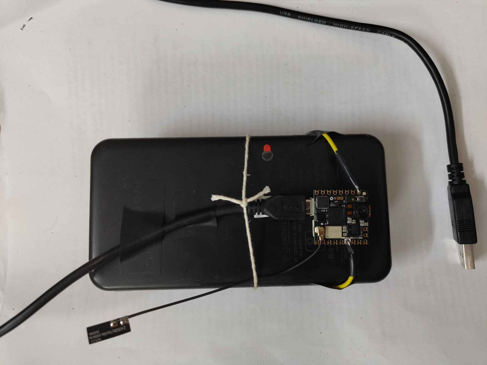
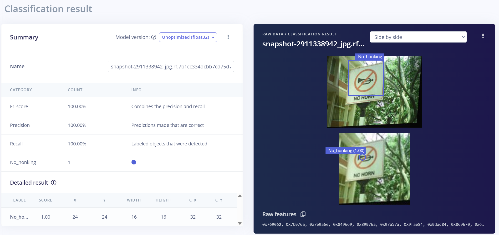
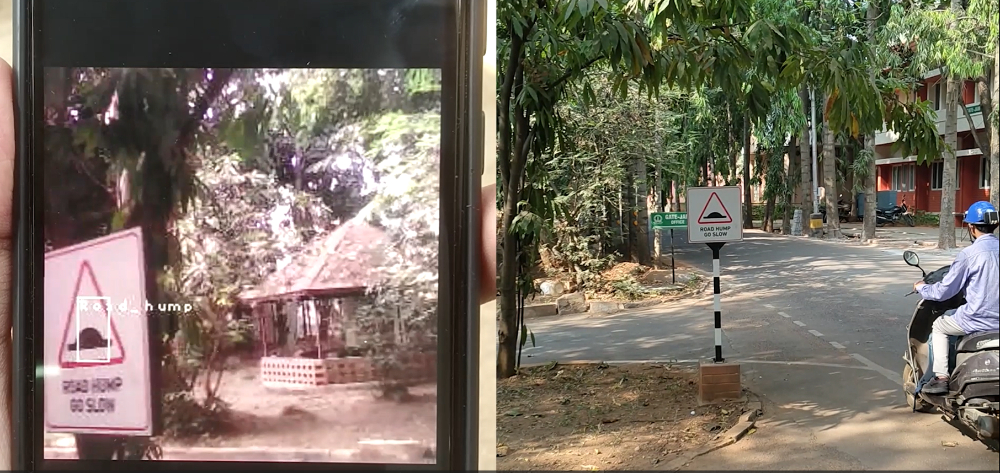
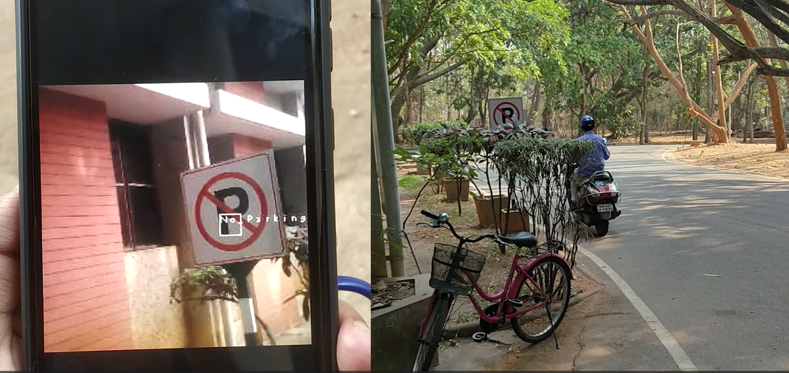
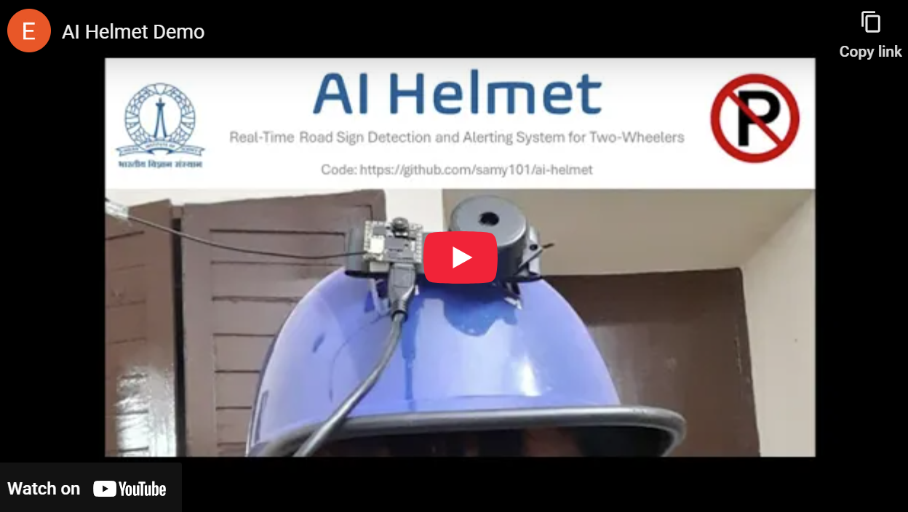

# 🪖 AI Helmet: Real-Time Road Sign Detection and Alerting System

This Edge Impulse project implements a **real-time, on-device road sign detection and alerting system** using the **Arduino Nicla Vision**. The goal is to prototype an **“AI Helmet”** that can detect critical road signs and provide immediate alerts to two-wheeler riders.

---

## 📁 Repository Structure

```text
.
├── data-collection/       # Scripts for on-device image capture using Nicla Vision + push button
├── dataset/               # Dataset references, class info, and augmentation notes
├── deployment/
│   └── OpenMV/            # MicroPython/OpenMV deployment script for on-device inference & alerts
├── images/                # Photos of the prototype and example detection outputs
└── README.md              # Project overview and documentation (this file)
````

---

## 🚥 Problem Statement

Traffic signs are essential for communicating rules, warnings, and guidance to road users. They inform riders about:

* Speed limits
* Road humps and hazards
* Parking and no-parking zones
* Restricted or special-use areas

However, two-wheeler riders often fail to notice or correctly interpret these signs due to:

* Visual clutter in dense urban environments
* Poor illumination or adverse weather
* Fatigue, distraction, or high cognitive load in traffic

While modern cars increasingly offer driver-assistance features like **speed-limit recognition**, most two-wheelers—especially in developing countries like India—provide **no comparable support**. This creates a gap between the importance of road signs and the assistance available to riders.

This project addresses that gap by exploring how existing helmets can be transformed into an **AI Helmet** using a small, low-power portable Edge AI device that perceives the surroundings using computer vision techniques—for example, detecting important sign boards in real time and actively alerting riders when such signs appear in their field of view.

---

## 🎯 Project Objectives

The main objective is to develop a prototype AI Helmet module that:

* Captures the rider’s forward-facing view using a compact camera
* Detects several categories of road and place-identification signs in real time
* Provides immediate feedback via:

  * Visual overlays (bounding boxes + labels)
  * Simple alerts (buzzer + RGB LEDs)
* Runs **entirely on-device** on a microcontroller-class edge platform (Arduino Nicla Vision), with **no cloud dependency**

The prototype demonstrates an **end-to-end Edge Impulse pipeline**:

> Data collection → Dataset & labels → FOMO model training → On-device deployment → Real-time alerts in a helmet-mounted setup.

---

## 🔧 Hardware & Software Used

### Hardware Required

* 🧠 **Arduino Nicla Vision**

  * 2 MP color camera
  * 1 MB RAM, 16 MB QSPI flash
  * Wi-Fi and IMU on board
* 🔋 **USB Power Bank**

  * To power the Nicla Vision on the helmet
* 🔘 **Push Button**

  * For image capture during data collection
* 🔔 **Buzzer**

  * For acoustic alerts (e.g., on critical sign detection)
* 💡 **RGB LEDs (onboard / external)**

  * For visual alerting based on detected sign type
* 🪖 **Two-wheeler Helmet**

  * To mount the Nicla Vision and power bank
* 🔌 **Jumper wires / mounting accessories**

  * For wiring, fixing the board, and cable management

### Software & Tools Used

* 🧪 **Edge Impulse Studio**

  * Data ingestion, labeling, impulse design, FOMO model training, deployment
* 🖥️ **OpenMV IDE**

  * Writing and flashing MicroPython deployment scripts to Nicla Vision
* 🐍 **MicroPython**

  * On-device runtime controlling camera, Wi-Fi, buzzer, and LEDs
* 📦 **TensorFlow Lite (via Edge Impulse)**

  * Inference engine for the deployed model
* 🧰 **Roboflow**

  * Dataset augmentation (cropping, color transforms, noise, etc.)
* 🌐 **Web browser**

  * Viewing the MJPEG debug stream during development

---


## 🧱 Hardware Platform

**Core device:** [Arduino Nicla Vision](https://store.arduino.cc/products/nicla-vision)

Nicla Vision is used because it combines:

* 📷 **2 MP color camera**
* 🧠 **1 MB RAM** and **16 MB QSPI flash**
* 📏 **Tiny form factor** suitable for helmet or bike mounting
* 💻 Support for **MicroPython**, **OpenMV**, and **Wi-Fi**

These capabilities make it possible to:

* Capture road scenes from a **helmet-like viewpoint**
* Run **Edge AI / TinyML models locally**
* Stream **annotated video** to a browser (for debugging and visualization)

---

## 📸 Data Collection

Data collection is done directly **on the Nicla Vision** using the scripts in `data-collection/`:

* A **push button** is wired to the board.
* A **USB power bank** powers the setup for portable use.
* A **MicroPython script** running on the Nicla Vision:

  * Captures an image from the onboard camera
  * Stores it in device memory each time the button is pressed

Using this simple setup, we collected images of **real sign boards** around a university campus, from a perspective that approximates a **helmet-mounted camera**.


*Figure 1: Data collection setup using Nicla Vision.*

---

## 🧮 Dataset & Augmentation

The captured images are imported into **Edge Impulse** for dataset preparation.

To improve generalization, we apply a variety of data augmentations (via **Roboflow** and **Edge Impulse**):

* Cropping and mild geometric transforms
* Grayscale conversion and brightness/exposure changes
* Hue and saturation adjustments
* Blur and noise injection

**Sign-board classes:**

* `Assembly point`
* `Go slow`
* `No honking`
* `No parking`
* `Parking`
* `Road hump`
* `Stop`
* `Speed limit`

**Dataset stats:**

* ~60 images per sign class
* **416 images total** across all classes
* An additional **background class** (added by Edge Impulse) represents scenes with **no sign board**, helping the model distinguish meaningful signs from ordinary road backgrounds.

---

## 🏷️ Annotation & Labeling

Bounding box annotation is carried out inside **Edge Impulse** using its labeling interface:

* An **AI-assisted auto-labeler** (YOLO-based) is first used to propose bounding boxes and class labels.
* All auto-generated labels are then **manually verified and corrected** where needed.

This hybrid strategy significantly speeds up labeling while maintaining high annotation quality suitable for embedded object detection.

---

## 🧠 Model Design: FOMO for TinyML

We use **Edge Impulse FOMO (Faster Objects, More Objects)** for TinyML-based object detection.

### Model Architecture

* Backbone: **MobileNetV2 0.35** (lightweight CNN)
* Detection head: **FOMO** (grid-based object detection)
* Designed to provide **class + approximate location** while fitting into a **microcontroller** memory and compute budget.

### Input Configuration

* Input image: **96 × 96 RGB**
* Flattened feature dimension: **27,648 (96 × 96 × 3)**

### Output Classes

The model predicts **7 object classes** (non-background):

* `Assembly_point`
* `Go_slow`
* `No_Parking`
* `No_honking`
* `Parking`
* `Road_hump`
* `Stop`

### Train / Test Split

* **81%** of samples used for **training**
* **19%** used for **testing**
* **20% of the training set** is further reserved as a **validation set**

---

## 🧪 Training Details (Edge Impulse)

The Keras-based object detection block in Edge Impulse uses a **FOMO-specific training script** with:

* **Loss:** Weighted cross-entropy (using `object_weight` to emphasize objects vs. background)
* **Epochs:** `100`
* **Learning rate:** `0.001`
* **Batch size:** `32`
* **Backbone width multiplier (alpha):** `0.35`
* **Checkpointing:** Best weights selected based on **validation F1 score (`val_f1`)**

After training, an explicit **softmax** layer is added to ensure per-cell probabilities are properly normalized.

### Validation (Quantized int8 Model)

On the **validation set**, the quantized (int8) model achieves:

* **F1 score (non-background):** `0.96`
* **Precision (non-background):** `0.98`
* **Recall (non-background):** `0.94`

### On-Device Performance (Nicla Vision)

Using the TensorFlow Lite engine for the **Arduino Nicla Vision**, Edge Impulse reports:

* **Inferencing time:** ≈ **51 ms** per frame
* **Peak RAM usage:** ≈ **283.1 KB**
* **Flash usage:** ≈ **111.0 KB**

This corresponds to roughly:

> **~19.6 frames per second (fps)**

which is sufficient for real-time detection and alerting on the helmet.


*Figure 2: Training results.*

### Test Set (Unoptimized float32 Model)

On the held-out test set, the **unoptimized (float32)** model achieves:

* **F1 score (non-background):** `0.93`
* **Precision (non-background):** `0.94`
* **Recall (non-background):** `0.93`


*Figure 3: Testing results.*

---

## 🧩 Impulse Design (Edge Impulse)

The complete impulse in Edge Impulse consists of:

1. **Input block:**

   * Type: *Image data*
   * Device: Arduino Nicla Vision
   * Resolution: 96 × 96 RGB

2. **Processing block:**

   * Type: *Image* (DSP)
   * Operations: resize, color handling, normalization

3. **Learning block:**

   * Type: *Object Detection (Images)*
   * Architecture: **FOMO MobileNetV2 0.35**
   * Output: 7 object classes + background (grid-based localization)

**Public impulse details:**
👉 [https://studio.edgeimpulse.com/public/841827/live/impulse/1/create-impulse](https://studio.edgeimpulse.com/public/841827/live/impulse/1/create-impulse)

---

## 🚀 On-Device Deployment (OpenMV + MicroPython)

Deployment is done via the scripts in `deployment/OpenMV/`.

After training and validation:

* The model is exported from Edge Impulse as an **OpenMV-compatible library**
  (TFLite model + C++/MicroPython support code).
* The deployment is done via the **OpenMV IDE** onto the **Arduino Nicla Vision**.

The **final deployed script**:

* Is based on auto-generated Edge Impulse code
* Is enhanced with:

  * **Alerting logic** (buzzer + RGB LEDs)
  * **Wi-Fi MJPEG streaming** (for debugging in a browser)

### Runtime Behavior

At runtime, the MicroPython/OpenMV script running on Nicla Vision:

* Initializes:

  * The camera (RGB565, QVGA, 240×240 window)
  * Buzzer pin
  * RGB LEDs
* Connects to Wi-Fi (for an optional browser-based **debug view**)
* Continuously:

  * Captures frames from the onboard camera
  * Applies the same preprocessing used during training
  * Runs **FOMO inference** on each frame
  * Draws bounding boxes and overlays the detected label on the image
  * Optionally streams the annotated frames via **MJPEG** to a browser on the same network (**debug/demo only**, not required for normal helmet use)
  * Triggers:

    * **Buzzer alerts**
    * Different **LED colors** for specific classes (e.g., `Stop`, `Go_slow`, `No_parking`, `Speed_limit`)

This combination of real-time detection, visual overlays, and simple acoustic/visual alerts allows the Nicla Vision module to act as an **AI Helmet assistant** without any cloud processing.

---

## 🪖 AI Helmet Prototype

The hardware prototype consists of:

* An **Arduino Nicla Vision** mounted on top of a **standard two-wheeler helmet**
* An **off-the-shelf USB power bank** fixed to the helmet or carried by the rider

The setup is compact and light enough that the helmet can be worn comfortably during real-world tests.


## 🎬 Demo (Real-Time Detection)

Below are example frames from the real-time detection pipeline running on the AI Helmet prototype:


*Figure 4: Demo 1 showing the detection of Road hump sign*



*Figure 5: Demo 2 showing the detection of No parking sign*


[](https://youtu.be/EtBIZRzOGV8)  
*Click the image above to watch the AI Helmet demo video on YouTube.*

---


## Planned Improvements

In future iterations, we plan to:

* Design a **custom 3D-printed enclosure** integrating:

  * Nicla Vision
  * Power bank
  * Wiring and button
* Make the module:

  * More **aesthetic**
  * More **durable**
  * Easier to mount on a wide range of commercial helmets

We also aim to extend the AI Helmet with:

* Support for **more traffic signs**
* **Real-time OCR** on place boards and speed signs, plus **speech output**
* **Audio sensing** to understand the surrounding environment (sirens, honks, approaching vehicles, etc.)
* Integration of additional **environmental and proximity sensors**, such as:

  * Air-quality and light sensors
  * Radar, lidar, and ultrasonic sensors

These extensions will progressively enable **richer ADAS-style features** for riders, turning the AI Helmet into a **multi-sensor safety and awareness platform**.

---


## 🌐 Edge Impulse Project Link

You can explore the full impulse design and training configuration here:

👉 **Public Edge Impulse Project:**
[Link](https://studio.edgeimpulse.com/public/841827/live)

---

## 👥 Team


(L to R in above image)

* **Kunal Wasnik** 
* **Sanjay Kumar**
* **Subhasis Panda**
* **Mentor:** Prof. Pandarasamy Arjunan, RBCCPS, Indian Institute of Science.

For questions, feedback, or collaboration opportunities, please contact: **[samy@iisc.ac.in](mailto:samy@iisc.ac.in)**
