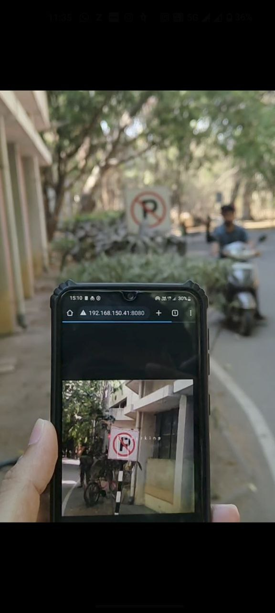

## 🚀 Deployment

### Steps to Run

1. **Update Wi-Fi credentials**  
   Open `main.py` and set your Wi-Fi details:
   - `SSID` = your Wi-Fi network name  
   - `KEY` = your Wi-Fi password  

2. **Copy model file and MicroPython script to Nicla Vision**  
   Connect the Arduino Nicla Vision over USB and copy the following files to its storage:
   - `main.py`  
   - `trained.tflite`  
   - `labels.txt`  

3. **Connect the buzzer (optional alerting)**  
   - Connect the **buzzer signal** to pin **A0** on the Nicla Vision.  
   - Connect the **other buzzer pin** to **GND**.  
   The buzzer will sound when certain sign boards are detected.

4. **View real-time detections in a browser (debugging)**  
   - Once powered and connected to Wi-Fi, the Nicla Vision starts an MJPEG stream on port `8080`.  
   - Open a browser and visit:  
     `http://<NICLA_IP_ADDRESS>:8080/`  
   - The IP address (e.g., `192.168.243.41`) can be:
     - Found using any standard IP scanner on your network, **or**
     - Read from the **OpenMV IDE serial monitor**, where the script prints the assigned IP after connecting to Wi-Fi.

*Figure 1: Demo 1 showing the detection of No parking sign*

### Additional Info 
1. Device blinks blue light when connected to WiFi.
2. Device blinks yellow light when other device open the ip address link to view camera output.

NOTE: 
On newer version firmware of openmv IDE , syntax is changed . You may have to change the code according to the different syntax (You may refer examples related to machine learning model in openmv IDE on how to make necessary changes.). Code is tested and works for openmv IDE version 4.1.5 (Link to older releases : https://github.com/openmv/openmv-ide/releases/ )

